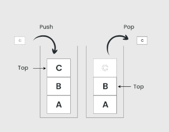
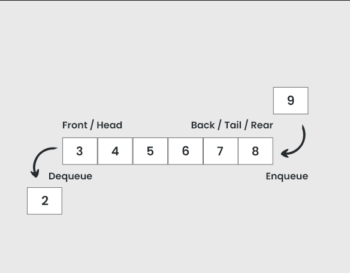

# Lecture1

1. * ### Basic Data Structure
   * Array
   * Pointer Array, deep copy, 얕은 복사
   * Linked List
   * Queue
   * Stack
   * Map
   * Hash Function

> 자료구조의 주요 개념과 연산만 배워봅시다. 구현은 다루지 않습니다. 그냥 STL가져다 쓰시면 됩니다. 물론 연습삼아 직접 공부하며 구현하는 것도 좋습니다.

## Basic Data Structure

예전 컴퓨터의 계산능력과 메모리는 한계가 명확했습니다. 정보처리량이 늘어남에 따라 이를 효율적으로 처리할 필요성이 생겨났으며, 다양한 자료구조가 연구되었습니다. 즉, 자료구조는 데이터(변수)집합을 **효율적으로** 접근/삽입/삭제하기위해 고안된 개념입니다.

기존의 array로는 데이터의 수 $n$이 늘어날수록 탐색/삽입/삭제하는 시간이 선형적으로 늘어납니다.(항상 최악의 경우 $O(n)$ 이 걸립니다.)

자료구조 연산만으로 쉽게 풀수있는 문제도 많습니다.

> plus, 추상적 자료형은 자료구조를 수학적으로 정의해놓은 모델을 뜻합니다.

## Pointer
자료구조에서 이해하고 넘어가야하는 기본적인 개념입니다. 가변적인 길이의 자료구조를 구현할때 Array를 기반으로 구현하면 메모리상에서 고정적인 자원을 잡아먹습니다.
보통 화살표로 표시됩니다.

특정 메모리에 접근하는 방법입니다.

### Shallow Copy
보통 파이썬 혹은 객체지향적인 언어를 다룰때, 클래스로 생성된 객체를 다룰때 자주 마주치게 되는 복사입니다.

클래스는 문법적으로 변수처럼 사용하곤 합니다.

이와 같이 클래스 객체를 "생성"할 수 있습니다. 이때 생성자라는 클레스 메서드(함수)를 통해 클래스 객체가 생성되며, 메모리 상에 객체의 메모리 공간이 할당됩니다.

하지만 실제 변수에 저장된 값은 생성자를 통해 생성된 객체의 **pointer(주소값)** 이 저장되어 있습니다.

이때 다른 클래스 객체를 복사하기위해 다음과 같은 할당연산을 시키면, 할당연산은 주소값을 할당시킬것 입니다. 그렇게 되면 두 변수는 같은 주소값을 가지게 됩니다. (즉, 실제로는 클래스 객체는 메모리상에서 복사되지 않습니다.)

다른 말로, 실제로는 클래스가 가진 value(값)을 복사한게 아니라 pointer(주소값)이 복사되게 됩니다.

이를 얕은 복사라고 합니다.

### Deep Copy
클래스 객체 자체를 복사하기 위해서는 생성자를 한번더 사용하여 복사해야 합니다. 이때 복사생성자가 사용됩니다.

### ect
깊은복사는 모든 값을 복사하여 할당하고, 새로운 객체를 생성하는 만큼 비용이 큽니다. $O(n)$

반면, 얕은 복사는 pointer만 복사하기 때문에 비용이 상수입니다. $O(1)$

이를 잘 응용하면 앞으로 배울 자료구조에서 효율적인 연산을 구현할 수 있습니다.

앞으로 나오게될 거의 모든 자료구조는 포인터를 사용한 가변적인 구조로 데이터를 다루는 형식입니다.

> plus, 특히 메모리를 정밀하게 사용할 수 있는 C/C++에서 정말 중요하게 사용되는 개념입니다.

## Array

가장 기본적인 자료구조 입니다. 

수학에서 Sequence(수열)에서 파생되었으며, 
순서가 있으며

기본적으로 array의 길이는 고정입니다. 이를 해결하기위해 가변길이 배열

## Linked List
array의 고정적인 메모리 위치와 고정길이를 해결하는 아이디어 입니다.

특정 

### search()
array와 같은 방식으로 접근합니다.

### insert()

### delete()

예시로 $n$개의 숫자중 최소의 숫자를 찾는 코드를 짜야한다 가정하자.

기본적인 array혹은 list자료구조에 정렬하지않고 사용한다면, 전체 $n$개의 숫자를 전부 찾아봐야한다. 즉 최소원소 탐색에 선형시간 $O(n)$이 걸립니다.

하지만 이후에 배울 BST자료구조를 사용한다면 $O(\log n)$, 심지어 heap을 사용한다면 상수시간 $O(1)$ 안에 찾을 수 있다. $n$이 늘어날수록 선형시간 $O(n)$에 비교해서 더욱 효율적인 탐색을 할수있습니다.

## Stack
array에서 삽입과 삭제가 어느 위치(pointer)에서든 일어날수 있었지만, stack은 그 위치를 하나로 강제하는 자료구조입니다.

stack은 다음과 같은 구조로 구성됩니다.

###### 이미지 출처 : https://www.geeksforgeeks.org/dsa/stack-data-structure/

덕분에 삽입/삭제/접근 연산에 상수시간 $O(1)$이 걸리게 됩니다. 하지만 전체 원소에 접근할 수 없으며, 오직 top에 올라온 원소에만 접근할 수 있습니다.

비유적으로 탄창같은 구조입니다.

### push() : $O(1)$
삽입연산입니다. 기존에 top에 있던 원소를 밑에 깔아버리고, 새로 삽입된 원소가 top에 위치하게 됩니다.

### pop() : $O(1)$
삭제연산입니다. top에 있는 원소 하나를 빼냅니다. 바로 밑에 깔려있던 원소가 top에 위치하게 됩니다.
> 파이썬은 pop메소드가 top원소를 반환합니다. C++의 STL은 그렇지 않습니다.

### top() : $O(1)$
top에 있는 원소에 접근하는 연산입니다.

### Last In First Out(LIFO)
stack은 구조적으로 이전에 어떤 순서로 자료가 들어간것과 상관없이 "가장 나중에 들어간 것이 가장 먼저 나오는" 성질이 있습니다. 이러한 성질을 후입선출(後入先出)이라 부릅니다. 가장 중요한 성질입니다. 알고리즘 문제풀이에서는 보통 이러한 성질을 응용하기위해 stack을 사용합니다.

### problem: infix to postfix
infix를 postfix로 만드는 문제에 사용하면 효과적으로 풀어낼 수 있습니다.

### ect
> plus, 보통 stack은 고정크기를 가지고 구현됩니다. 예외 코드 없이, 크기 이상으로 채워넣게되면 stack이 다른 메모리 영역을 침범하는 일이 발생합니다. 이를 stack overflow라고 하며 동명의 유명한 프로그래머 질문 커뮤니티 사이트가 있습니다.

## Queue
queue또한 stack과 마찬가지로 삽입/삭제/접근의 위치(pointer)를 강제하는 자료구조입니다. 다만 stack과 그 위치가 다릅니다.

###### 이미지 출처 :  https://www.geeksforgeeks.org/dsa/queue-data-structure/

stack과 다르게 삽입연산과 삭제연산이 일어나는 위치가 각각 front와 back으로 다른것을 알 수 있습니다. front와 back 이외 원소에는 접근할 수 없습니다.

비유적으로 

### enqueue() : $O(1)$
삽입연산입니다. back에 있는 원소 뒤에 새로운 원소를 삼입합니다. 새로 삽입된 원소가 back에 위치하게 됩니다.

> 보통 queue에서 enqueue대신 push을 명칭으로 사용하곤 합니다. 각 언어의 STL에서 구현된 메소드 명칭이 push인 경우가 많습니다. 

### dequeue() : $O(1)$
삭제연산입니다. front에 있는 원소 하나를 빼내고, 그 다음 원소가 front로 위치하게 됩니다.

> dequeue 또한 pop을 명칭으로 사용하곤 합니다. push와 pop이 의미적으로 직관성이 크기 때문에 많이 사용됩니다.

### front() / head() : $O(1)$
front에 있는 원소에 접근하는 연산입니다. 보통 front로 씁니다.

### back() / tail() : $O(1)$
back에 있는 원소에 접근하는 연산입니다. 보통 back으로 씁니다.

### First In First Out(FIFO)
queue는 구조적으로 이전에 어떤 순서로 자료가 들어간것과 상관없이 "가장 먼저 들어간 것이 가장 먼저 나오는" 성질이 있습니다. 이러한 성질을 선입선출(先入先出)이라 부릅니다. queue 또한 stack과 마찬가지로 알고리즘 문제풀이에서는 보통 이러한 성질을 응용하기위해 사용됩니다.

### ect
> plus, queue는 이름이 비슷한 자료구조가 여럿 있습니다. linear queue(선형 큐)와 circular queue(원형 큐)라는 자료구조가 있습니다. 이는 같은 queue 이지만 다른 방식으로 구현된 자료구조입니다. 하지만, 이후 4장에서 배우는 priority queue(우선순위 큐)는 queue와 다른 성질을 가진 자료구조 입니다.

## Double Ended Queue(deque or deck)
front, back에서 전부 삽입/삭제 연산을 할수있도록 만든 자료구조가 있습니다. 덱 이라고 불리며, stack과 queue의 역할을 동시에 수행할 수 있습니다. 

## Map
map은 수학적으로 사상(寫像)을 의미하는데 대충 수학적인 function(함수)의 개념입니다. 쉽게 보면 일방적인 대응관계를 말합니다.

함수의 중요한 개념 2가지가 있습니다.
1. 단사: 단일 원소가 중복없이 대응됨
2. 전사: 전체 원소가 대응됨

역산할수 없어야한다.(마치 mod연산)
이를 $key \to value$의 대응관게로 자료구조를 만들수 있습니다. 

사실 1대1대응을 만드는건데 이게 왜 필요한지 궁금할 수 있습니다. 

중요한건 $key$를 알때 $value$에 접근하는 시간이 상수시간 $O(1)$걸린다는 사실입니다. 때문에 map의 진가는 서로다른 자료형 간의 대응관게를 만들때 굉장히 유용합니다. 특정 문자열과 정수 사이에 대응관계를 만들어 $string \to int$ 로 접근하는것을 상수시간에 해결하는것은 굉장히 효과적입니다.

### Hash Function
Hash 함수를 이용하여 map을 구현하는 방식을 hash map 혹은 hash table이라고 합니다. 헤쉬함수는 쉽게 말하면 거의 무작위에 가까운 대응관계를 만들수있는 전단사함수입니다.

> 사실 hash함수가 아니라면 대응관계는 수학적으로 쉽게 예측 가능합니다. 그렇기 때문에 특정 key에 대응되는 value 값을 굳이 map을 쓰지 않더라도, 직접 계산을 통해 value가 있는 메모리 위치를 찾아낼 수 있습니다. 이는 정보보안 측면에서 상당히 위험합니다.  

기본
12789
2164
24511

심화
13335
