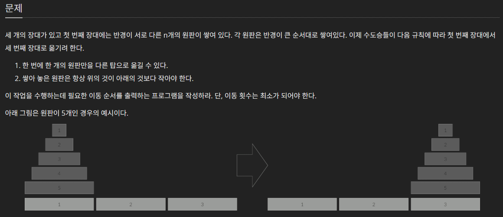

# Lecture5

5. * ### Divide and Conquer
   * Bineary Search
   * Problem: Fibonacci Sequence
   * Problem: Hanoi Tower
   * Problem: Matrix Multification
   * Strassen Algoritm


> plus, 수학적 귀납법을 사용하는 멋진 예시 https://youtu.be/sIMbG0yAdx0?feature=shared (영상에서 축소라는 개념을 분할이라는 명칭으로 생각하면 좋습니다.)


## Divide and Conquer

생각해야할것은 이것입니다.   
"어떤 n번째 단계의 문제를 풀기위해 필요한 단계는?"

예시들을 보면서 감을 익혀봅시다.

> plus, 

### 디테일
시작점을 무엇으로 잡느냐에 따라 

### 축소


### 확대

> plus, 아~ 미카 공주 잘 모르겠고 전단계부터 생각할레~


## Problem: Fibonacci Sequence

매우 유명한 피보나치 수열입니다.   
피보나치 수열은 다음 점화식에 의해 정의됩니다.  

$$a_{n}=a_{n-1}+a_{n-2}$$
$$where\ a_1=1,a_2=1$$

점화식에서 알수있다시피, $a_{n}$ 을 구하기 위해서는 $a_{n-1}, a_{n-2}$ 를 구해야합니다.

분할정복 관점에서 보면 점화식은 직관적으로 문제를 분할하는 관계를 나타내는으로 볼수있습니다. 피보나치 수열의 경우, n번째 항을 구하기 위한 조건은 n-1,n-2번째 항을 구하는 것입니다.

즉, $P(n): a_{n-1},\ a_{n-2}$    
$P(n-2), P(n-1)\to P(n)$ 의 관계를 나타냅니다.

$P(1), P(2)$ 에 대해서 초항 $a_1=1,a_2=1$

너무 기초적인 문제를 뺑뺑 돌아서 푸는거 아닌가 생각할수 있습니다. 하지만 관점이 중요합니다.


> plus, 생각해보면 피보나치 수열에서 중복되는 계산이 있다는것을 알 수 있습니다. 중복되는 계산값을 table에 저장해두고 사용한다면 전체적인 계산량을 줄일수 있을 것 입니다. 이후 dynamic programming에서 memoization의 개념이며, 다음쳅터에서 배울수 있습니다.

### Solution and Time Complexity

```cpp

```


### General term
피보나치 수열의 일반항을 다음과 같이 구해집니다.

우선 homogeneous equation(제차 방정식) 형태로 만들고, 피보나치의 일반항이 

> plus, 황금비로 유명합니다.


## Problem: Hanoi Tower

하노이탑 문제는 분할정복 문제로 아주 기본적인 예시중 하나입니다.


###### https://www.acmicpc.net/problem/1914


여기서 풀고싶은 것을 명제화 하면 다음과 같이 쓸수있습니다.

명제 $P((A,B,C),n)$

함수 $f((A,B,C),n):$"중간에 기둥 B를 두고, A기둥에서 C기둥으로 n개의 원판이 쌓인 탑을 옮기는 __횟수.__"

그럼 한번 이를 풀어봅시다. 우선 접근하기 쉽지 않습니다.

문제가 해결된 상황을 어떻게 나눠볼수 있을까요? 이를 중심으로 생각해봅시다.

1. 문제가 어떻게 풀어지든 필수적으로 행해야 하는 동작은 무엇일까요?
   * 가장 밑에 깔린 n번째 원판 1개가 옮겨져야 합니다. $move_{A\to C} = 1$
2. 그것을 위해서 또 필수적으로 필요한 동작은 무엇인가요?
   * A기둥에서 가장 밑의 n번째 원판을 제외한 모든 n-1개의 원판을 B기둥에 옮겨야 합니다. $f((A,C,B),n-1)$
3. 남은 문제를 어떻게 같은문제로 표현할 수 있나요?
   * B기둥에 치워진 원판을 C기둥으로 옮겨야 합니다. $f((B,A,C),n-1)$
4. 초기조건은 무엇인가요?
   * 원판은 최소 1개 이므로 $f((A,B,C),1)=move_{A\to C},\ f((B,A,C),1)=move_{B\to C}$

1,2,3을 정리해보면, 문제 $f((A,B,C),n)$를 다음과 같은 관계식으로 정리할수있습니다.

$$f((A,B,C),n)=f((A,C,B),n-1)+move_{A\to C}+f((B,A,C),n-1)$$

예시로 $f((A,B,C),3)$을 풀어봅시다.

$$f((A,B,C),3)=f((A,C,B),2)+move_{A\to C}+f((B,A,C),2)$$
$$f((A,B,C),3)=f((A,C,B),2)+move_{A\to C}+f((B,A,C),2)$$

덧셈에는 순서관계가 유지되지 않지만, 편의상 순서관계를 고려한다면 하노이탑의 이동순서 또한 구할 수 있습니다.

이러한 풀이가 가지는 이점은 어떤 큰 차수의 문제를 작은 차수의 문제로 축소시킨다는 점입니다.

수학적 귀납법을 확장이 아닌 축소의 개념으로 바라보는 느낌입니다.

이게 수학적인 풀이법입니다.


1,2를 정리해보면, 
$$P((A,C,B),n-1)\to P((B,A,C),n-1)\to P((A,B,C),n)$$
3의 동치관계를 이용하면,
$$P((A,C,B),n-1)\to P((B,A,C),n-1)\to P((A,B,C),n)$$

> plus, 사실 명제논리로 풀어야하는데 직관적으로 함수를 사용한 풀이를 적어보았습니다. 설명에 사소한 오류가 존재할수있으나, 풀이 방식관점 자체를 중점으로 보기에는 문제없을 것 입니다. (아마도?)

### Solution and Time Complexity

```cpp

```

### General term

막대 $A,B,C$의 순서가 바뀌여도 원판을 옮기는 횟수는 동일합니다. 즉, 기둥의 순서는 원판 이동 횟수와 무관합니다. $f((A,B,C),n)\iff f(n)$

따라서 위의 관계식을 아래와 같이 풀어낼 수 있습니다.

$$f(n)=f(n-1)+move+f(n-1)$$
$$f(n)=2f(n-1)+1$$
$$f(n) = 1+2+...+2^{n-1} = 2^{n}-1$$

> plus, 문제가 가진 어떤 성질을 파악하고, 이용하는것은 아주 중요합니다. 예시로 체스판을 가지고 푸는 문제들은 대부분, 판을 뒤집고, 돌려도 원본 문제와 똑같다는 성질을 가지고 있습니다.


## Problem: Matrix Multification

## Strassen Algoritm